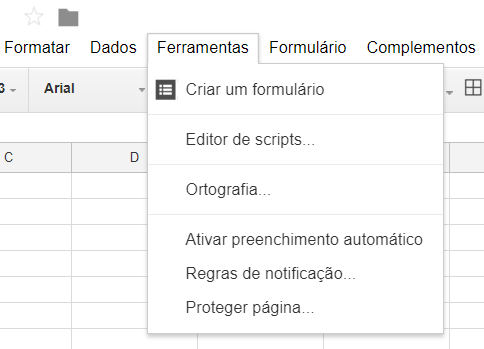
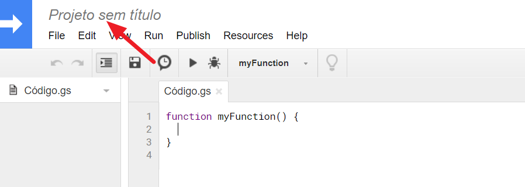
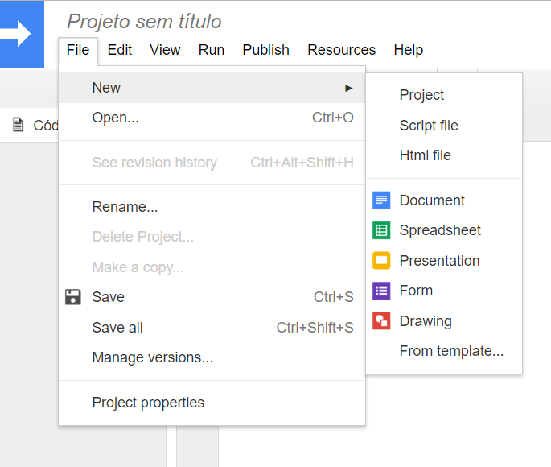

# Estrutura do Documento
Para o devido funcionamento deste script é necessario de 4 arquivos:

 * Uma "Formulário Google". - Ele servirá de entrada de dados do sistema é o unico "arquivo" que o usuário final terá acesso.
 * Uma "Planilha Google" - Ela é seu banco de dados, aqui serão depositadas todas as respostas do seu formulário, é onde serão feitas algumas operações necessarias e o script que fará as funções mais avançadas é criado nesta planilha.
 * Um Script. - Ele é criado diretamente na planilha, ele é responsável pelas interações entre APIs do Google.
 * Um "Documentos Google". - Ele é o modelo utilizado para gerar o recibo propriamente dito.

## O formuário

Devido a necessidade de modificações constantes (adicionar ou retirar itens) deste formulário optou-se pela utilização de um "Formumário Google", pois com ele é facil modificar o conteúdo dos seus campos.
Todos os campos do formulário são de preenchimento obrigatório.

### Senha de acesso:
Este campo é um campo de validação necessário para garantir que apenas membros do IEEE possam utilizar o formulário:

!!! note  ""
	Titulo do campo: Senha de acesso.

	Tipo de campo: Resposta curta

	Validada por uma expressão regular* do tipo: 

	​``` 
	^suasenha$
	​```
    
	Mensagem de aviso em caso de erro: Senha inválida!

Para modificar a senha você deve moficar a parte textual do validador. Os simbolos `^` e `$` são comandos da expressão regular. No exemplo da figura a o usuário deve escrever "suasenha" para conseguir validar a resposta.

[](imagens/Recibos/cr_senha.png)


### Referente à:
Neste Campo selecionarei o motivo gerador do recibo, ou seja o que o destinatário do recibo está adquirindo. 

!!! note  ""
	Titulo do campo: Referente à (ao):

	Tipo de campo: Lista suspensa


Para adicionar um campo basta digitar o produto na linha "Adicionar opção". É importante que o texto escrito neste campo faça sentido quando se ler a segunte frase ".... referente a(o) **OPÇÃO**". Para remover um campo basta clicar no "X" que está à direita. Na figura abaixo é possivel visualizar estas ações.

[](imagens/Recibos/cr_refetentea.png)

### Unidade Responsável:
Campo em que é será selecionada a unidade que está recebendo do dinheiro referente ao recibo.

!!! note  ""
	Titulo do campo: Unidade Responsável:

	Tipo de campo: Lista suspensa


Para adicionar um campo basta digitar o produto na linha "Adicionar opção". É de extrema importência que utilizem apenas as siglas da unidade para referenciar ela. Para remover um campo basta clicar no "X" que está à direita. 

### Nome Completo

Local onde deverá ser preenchido o nome completo da pessoa que receberá o recibo.

!!! note  ""
	Titulo do campo: Come completo.

	Tipo de campo: Resposta curta

[](imagens/Recibos/cr_nome.png)

### CPF

Campo para registro dos numéros do CPF da pessoa que adquiriu que receberá o recibo.

!!! note  ""
	Titulo do campo: CPF.

	Tipo de campo: Resposta curta

	Descrição: Insira apenas os números CPF.

	Validada por uma expressão regular do tipo: correspondente à:

	​``` 
	([0-9]{11})
	​``` 
	
	Mensagem de aviso em caso de erro: Formato de CPF inválido!

[](imagens/Recibos/cr_CPF.png)

A expressão regular me diz para escrever 11 digitos numéricos qualquer coisa diferente disso ela me retornará a mensagem de erro.

### Valor

Este campo é onde devemos digitar o valor do recibo.

!!! note  ""
	Titulo do campo: Valor pago em Reais.

	Tipo de campo: Resposta curta

	Descrição: Valor deve ser dado em Reais e sempre positivo. Caso necessário, utilize o separador ponto. Se o evento for gratuito, digite 0.

	Validada por uma expressão regular* do tipo: correspondente à:

	​``` 
	^([1-9]{1}[\d]{0,2}(\.[\d]{2})*(\.[\d]{0,2})?|[1-9]{1}[\d]{0,}(\.[\d]{0,2})?|0(\.[\d]{0,2})?|(\.[\d]{1,2})?)$
	​```
	
	Mensagem de aviso em caso de erro: Utilize o padrão 00.00

[](imagens/Recibos/cr_valor.png)

A expressão regular deste campo me permite digitar numeros de até duas casas decimais separados por ponto.

### E-mail
Campo para o E-mail da pessoa que receberá o recibo.

!!! note  ""
	Titulo do campo: E-mail.

	Tipo de campo: Resposta curta

	Descrição: Insira o e-mail para o qual o recibo será enviado.

	Validada por uma expressão regular* do tipo: correspondente à:

	​``` 
	[a-zA-Z0-9_\.\+-]+@[a-zA-Z0-9-]+\.[a-zA-Z0-9-\.]+
	​```
	
	Mensagem de aviso em caso de erro: Digite um e-mail válido.

[](imagens/Recibos/cr_email.png)

## A Planilha Google

A planilha de respostas deve ser vinculáda ao formulário! Para fazer isso vá na aba respostas do seu form e clique nos tres pontinhos mostrado na figura abaixo.

[](imagens/Recibos/cr_planilhaform.png)

Um menu irá aparecer, selecione a opção "Selecionar destino da resposta". Uma janela semelhante amostrada a baixo apareceu em sua tela crie uma nova planilha ou selecione uma já existente (aconselho criar uma nova planilha).

[](imagens/Recibos/cr_planilhamenu.png)

A planilha criada (ou a aba da nova planilha) deve ser assim:

[](imagens/Recibos/cr_planilhacriada.png)

### Renomeie a pasta de trabalho!
Troque o nome da sua pasta de trabalho para "Recibos", para fazer isso clique com botão direito sobre o nome da pasta de trabalho e vá em renomear.

[](imagens/Recibos/cr_renomearplanilha.png)

### Campo 
Vá insira uma nova coluna a esquerda da coluna "A" (clique na celula "A" com botão direito e vá em incerir coluna à esquerda)

[](imagens/Recibos/cr_campo.png)


Na nova A1 agora vazia escreva a palavra "". Sua nova planilha deve ficar assim:

[](imagens/Recibos/resultadocampo.png)

### Data e Hora
Crie uma nova coluna C de forma que a coluna B seja o "Carimbo de data/hora" e a coluna "D" seja a "Digite a senha de acesso:" na selula B1 digite a segunte formula:

[](imagens/Recibos/cr_novacolunac.png)

``` 
=arrayFormula(SE(LIN(INDIRETO("B1:B" & TEXTO(CONT.VALORES(B:B);"#")))=1;"Data e Hora";TEXTO(DIA(B1:B);"##")&" de "& TEXTO(B1:B;"MMMM")&" de " & ANO(B1:B)&" às "&  TEXTO(HORA(B1:B);"00")&"h"&TEXTO(MINUTO(B1:B);"00")))
```

Essa formula é responsabel por retirar pegar da Data da coluna B e transformar ela num texto com o seguinte formato: "1 de janeiro de 1900 às 00h00."

### E-Mail
O campo E-mail deve estar agora na coluna J. Você vai incerir 4 novas colunas a esqueda deste campo fazendo assim que seu campo e-mail vá para coluna "N".

[](imagens/Recibos/cr_novocampoemail.png)

### Tipo de Transação
Na Coluna "J" (que deveria estar vazia) vá até a celula K1 e digite: 

``` 
=arrayFormula(IF(ROW(INDIRECT("A1:A" & TEXT(COUNTA(A:A);"#")))=1;"Tipo de transação";"Entrada"))
```

Assim para cada valor linha que for preenchida na planilha voce irá dizer que é uma "Entrada de Caixa"

### Valor pago em Reais

Na celula K1 digete a seguinte formula, (a coluna L deve estar vazia)

``` 
=query(A:K; "select I where I is not null format I 'R$#####0.00' ";1)
```

Ela formata os valores de I (Compo "Valor pago em Reais:" do formulário) para formato monetário.

### Ano
Na Celula L1 digite a formula abaixo para extrair o ANO em que foi emitido o recibo.

``` 
=arrayFormula(IF(ROW(INDIRECT("B1:B" & TEXT(COUNTA(B:B);"#")))=1;"Ano";YEAR(B1:B)))
```

### Mes
Na Celula M1 digite a formula abaixo para extrair o MES em que foi emitido o recibo.

``` 
=arrayFormula(SE(LIN(INDIRETO("B1:B" & TEXTO(CONT.VALORES(B:B);"#")))=1;"Mês";TEXTO(B1:B;"MM")))
```

### Pasta Administrativa
Crie uma nova Pasta de trabalho e troque seu nome para "Pasta adm". Nesta pasta vá ate A1 e digite Unidade, de A2 até A9 o nome das unidades (Ramo, AESS, CS, CPMT, EMBS, PES, RAS ,TEMS) na celula C1 digite: "Nº de Recibos +1" em C2 copie a seguinte formula:

``` 
=CONT.SES(Recibos!F:F;A2;Recibos!L:L;"=2017")+1
```

O valor retornado será o número de recibos já emitidos somado a 1. Veja o Exemplo abaixo: Atente-se ao detalhe que que a coluna B está oculta!

[](imagens/Recibos/cr_pastaAdm.png)

## Doc

## Script

O Script usado será criado a partir da Planilha que recebe dados do formulário para isso com a planilha aberta no menu `ferramentas` e escolha a opção `Editor de Scripts`

[](imagens/Recibos/sc_criarscript.png)

Feito isso uma nova aba semelhante a figura abaixo será aberta, clique no campo "Projetosem título" e defina um nome para o Seu projeto.  

[](imagens/Recibos/sc_pgnovoscript.png)

Para criar um novo arquivo vá no menu `file` depois em `New` e escolha o tipo de arquivo.

[](imagens/Recibos/sc_novodocscript.png)

## Script Modelo HTML

Crie um arquivo HTML no script utilizando os passos mostrados na seção [Script](#script). Esse arquivo deve ser nomeado como `rec_email_template` e servirá como template do e-mail que será enviado! esse novo arquivo é escrito em HTML o modelo utilizado atualmente é:

``` html
<!DOCTYPE html>
<html>
<body>
    <div>
        <h2 class="center-align teal-text">Olá <?= nome_completo ?>!</h2> Você está recebendo este e-mail pois no dia <b> <?= datarecibo  ?></b> você efetuou um pagamento no valor de <b>R$<?= valor ?> (<?= valorextenso ?>)</b> referente a/ao <b><?= evento ?></b>. Seu recibo foi anexado neste email e se necessario pode ser identificado pelo ID: <b> <?=  idrecibo  ?></b>.
    </div>
    <!-- Assinatura  -->
    <br>
    <hr>
    <table>
        <tr>
            <td>
                
            </td>
            <td> 
                <b style="word-space:2em">&nbsp;&nbsp;</b> Site: ieeeufabc.org
                <br>
                <b style="word-space:2em">&nbsp;&nbsp;</b> Facebook: facebook.com/ieee.ufabc
                <br>
                <b style="word-space:2em">&nbsp;&nbsp;</b> Twitter: @ieeeufabc
                <br>
            </td>
        </tr>
    </table>
</body>
</html>
```

## Script Arquivo gs

### Função formatMoney(casas, separador dec, separado milhar)
```js
Number.prototype.formatMoney = function(c, d, t){
var n = this, 
    c = isNaN(c = Math.abs(c)) ? 2 : c, 
    d = d == undefined ? "." : d, 
    t = t == undefined ? "," : t, 
    s = n < 0 ? "-" : "", 
    i = String(parseInt(n = Math.abs(Number(n) || 0).toFixed(c))), 
    j = (j = i.length) > 3 ? j % 3 : 0;
   return s + (j ? i.substr(0, j) + t : "") + i.substr(j).replace(/(\d{3})(?=\d)/g, "$1" + t) + (c ? d + Math.abs(n - i).toFixed(c).slice(2) : "");
 };
```

Formata um numro para um o formato decimal com número de casas "C", o separador decimal padrão é "." e o separador milhar padrão é ","

No exemplo aplicado abaixo a saida seria 25,50
```js
(25.5).formatMoney(2, ',', '');
```

### Função right(valor)

```js
String.prototype.right = function() {
    return this.substr(this.length - (arguments[0] == undefined ? 1 : parseInt(arguments[0])), this.length);
}
```

Ela serve para extrair as x últimas letras de uma String.

No exemplo aplicado abaixo a saida é "plo". 
```js
var texto = exemplo
texto.right(3);
```

### Função pad(x,y)
```js
function pad(number, length) {
    var str = '' + number;
    while (str.length < length) {
        str = '0' + str;
    }
    return str;
}
```

Ela serve para escrever um número sempre utilizando um numero x de casas.

No exemplo aplicado abaixo a saida é "0006". 

```js
pad(6,4) 
```

### Funçao Extenso(x)

Está função foi desenvolvida pelo Marcelo Camargo e copiada deste [link](https://productforums.google.com/forum/?nomobile=true#!topic/docs-pt/5dZ-BxqBoP4;context-place=topicsearchin/docs-pt/EXTENSO%7Csort:date)


??? note "Abra para ver o código da função"
    ```js
    function Extenso(n, moeda, moedas, centavo, centavos) {
    var j, x, m, r, ri, rd, d, i, casas, erro;
    var v1 = 0,
        v2 = 0,
        v3 = 0,
        v4 = 0,
        v5 = 0,
        v6 = 0;
    r = "";
    rd = "";
    ri = "";
    i = parseInt(n);
    d = n - i;
    d = d.toFixed(2);
    d = d * 100;
    d = d.toFixed(0);
    casas = i.toString().length;

    if (n == "?") {
        return "Função Extenso() Marcelo Camargo - marcelocamargo@gmail.com";
    }
    if (n < 0) {
        return "Erro: número negativo";
    }
    if (moeda != null) {
        if (moedas == null || centavo == null || centavos == null || moeda == "" || moedas == "" || centavo == "" || centavos == "") {
            return "Erro: parâmetros de moeda";
        }
    }

    if (d == 100) {
        d = 0;
        i = i + 1;
    }

    if (casas > 12) {
        v5 = (parseInt(i / 1000000000000) * 1000000000000 - parseInt(i / 1000000000000000) * 1000000000000000) / 1000000000000;
        if (v5 > 0) {
            j = "";
            x = CentenaExtenso(v5);
            if (v5 > 1) {
                ri = ri + j + x + " trilhões";
            } else {
                ri = ri + j + x + " trilhão";
            }
        }
    }
    if (casas > 9) {
        v4 = (parseInt(i / 1000000000) * 1000000000 - parseInt(i / 1000000000000) * 1000000000000) / 1000000000;
        if (v4 > 0) {
            if (v5) {
                j = ", ";
            } else {
                j = "";
            }
            x = CentenaExtenso(v4);
            if (v4 > 1) {
                ri = ri + j + x + " bilhões";
            } else {
                ri = ri + j + x + " bilhão";
            }
        }
    }
    if (casas > 6) {
        v3 = (parseInt(i / 1000000) * 1000000 - parseInt(i / 1000000000) * 1000000000) / 1000000;
        if (v3 > 0) {
            if (v4 + v5) {
                j = ", ";
            } else {
                j = "";
            }
            x = CentenaExtenso(v3);
            if (v3 > 1) {
                ri = ri + j + x + " milhões";
            } else {
                ri = ri + j + x + " milhão";
            }
        }
    }
    if (casas > 3) {
        v2 = (parseInt(i / 1000) * 1000 - parseInt(i / 1000000) * 1000000) / 1000;
        if (v2 > 0) {
            if (v3 + v4 + v5) {
                j = ", ";
            } else {
                j = "";
            }
            x = CentenaExtenso(v2);
            if (v2 == 1) {
                ri = ri + j + "mil";
            } else {
                ri = ri + j + x + " mil";
            }
        }
    }
    if (casas > 0) {
        v1 = (parseInt(i).toFixed(0)) - (parseInt(i / 1000).toFixed(0) * 1000);
        if (v1 > 0) {
            if (v2 + v3 + v4 + v5) {
                if (v1 <= 100) {
                    j = " e ";
                } else {
                    j = ", ";
                }
            } else {
                j = "";
            }
            x = CentenaExtenso(v1);
            ri = ri + j + x;
        }
    }

    if (moeda == null) {
        moedas = "reais";
        moeda = "real";
        centavos = "centavos";
        centavo = "centavo";
    }
    if ((d != 0 && moeda == "inteiro") || moeda != "inteiro") {
        if (i > 0 && !v1) {
            ri = ri + " de " + moedas;
        } else if (i > 1 && v1 == 1) {
            ri = ri + " " + moedas;
        } else if (v1 == 1) {
            ri = ri + " " + moeda;
        } else if (v1 > 1) {
            ri = ri + " " + moedas;
        } else if (i == 1) {
            ri = ri + " " + moeda;
        }
    }

    if (d == 1) {
        rd = "um " + centavo;
    } else if (d > 1 && d < 100) {
        rd = CentenaExtenso(d) + " " + centavos;
    }
    if (i < 1 && d > 0 && moeda != "inteiro") {
        rd = rd + " de " + moeda;
    } else if (i == 0 && d == 0) {
        rd = "zero " + moeda;
    }

    if (d > 0 && i > 0) {
        rd = " e " + rd;
    }

    r = ri + rd;
    return r;

    }

    function CentenaExtenso(n) {
        var u, d, c, casas;
        var r = "";
        var t1 = ["um", "dois", "três", "quatro", "cinco", "seis", "sete", "oito", "nove"];
        var t2 = ["dez", "onze", "doze", "treze", "quatorze", "quinze", "dezesseis", "dezessete", "dezoito", "dezenove"];
        var t3 = ["vinte", "trinta", "quarenta", "cinquenta", "sessenta", "setenta", "oitenta", "noventa"];
        var t4 = ["cento", "duzentos", "trezentos", "quatrocentos", "quinhentos", "seiscentos", "setecentos", "oitocentos", "novecentos"];
        casas = n.toString().length;
        u = 0;
        d = 0;
        c = 0;
        if (n > 0) {
            u = parseInt(n.toString().substr(casas - 1, 1));
        }
        if (n > 9) {
            d = parseInt(n.toString().substr(casas - 2, 1));
        }
        if (n > 99) {
            c = parseInt(n.toString().substr(casas - 3, 1));
        }
        if (n == 100) {
            return "cem";
        } else {
            if (c > 0) {
                r = r + t4[c - 1];
                if (d > 0 || u > 0) {
                    r = r + " e ";
                }
            }
            if (d > 1) {
                r = r + t3[d - 2];
                if (u > 0) {
                    r = r + " e ";
                }
            } else if (d == 1 && u >= 0) {
                r = r + t2[d + u - 1];
            }
            if (u > 0 && d != 1) {
                r = r + t1[u - 1];
            }
        }
        return r;
    }
    ```


Ela serve para escrever um número por extenso. O valor de entrada deve obtigatoriamente ser definido como Number!

No exemplo aplicado abaixo a saida é "cento e cinco". 
``` js
Extenso(105)
```

### Função Recibo

Está função é a função que trata os dados do formulário para gerar o recibo e enviar suas copias para o destinatário e para uma pasta do driver. Por ela ser uma funçao muito grande irei fragmenta-lá e explicar a passo como construir ela.

??? note "Abra para ver o código da função completo"
    ``` js
    function send_Rec_Email() {
        //  do modelo recibo no Google Docs
        var recibotemplateId = "14Zlj5zwYyWHhAUnBG9dMFYTzeClIa_xvayxJsB8k_Os"
        
        // Carrega planilha ativa
        var ss = App.getActive()
        //var ss = App.getActive().getSheetByName("Recibos")
        
        var dados = ss.getDataRange().getValues();
        var ultimaLinha = ss.getLastRow() - 1; //Pega a última linha da tabela
        
        // Defino a pasta 2 da minha planilha como ativa
        var sheet = App.openById(submissionSSKey).getSheets()[2];
        
        // informações da planilha
      // var datarecibo = dados[ultimaLinha]['coloque aqui o nº da coluna onde ficara o data do recibo , lembrando que a coluna A vale 0(zero)'];
        var datarecibo = dados[ultimaLinha][2];

        // var evento = dados[ultimaLinha]['coloque aqui o nº da coluna onde ficara o valor do curso, lembrando que a coluna A vale 0(zero)'];
        var evento = dados[ultimaLinha][4];
        
        // var unidade = dados[ultimaLinha]['coloque aqui o nº da coluna onde ficara o unidade responsavel, lembrando que a coluna A vale 0(zero)'];
        var unidade = dados[ultimaLinha][5];
        
        // var nome_completo = dados[ultimaLinha]['coloque aqui o nº da coluna onde ficara o Nome completo da pessoa, lembrando que a coluna A vale 0(zero)'];
        var nome_completo = dados[ultimaLinha][6];
        
        // var CPF = dados[ultimaLinha]['coloque aqui o nº da coluna onde ficara o CPF da pessoa, lembrando que a coluna A vale 0(zero)'];
        var CPF = String(dados[ultimaLinha][7]);
        
        // Formata o CPF no formato de 123.456.789-11
        if (CPF.lenght != 11) {
            CPF = '0'.concat(CPF);
        }
        var CPF = CPF.replace(/^(\d{3})(\d{3})(\d{3})(\d{2})/, "$1.$2.$3-$4");
        
        // var valor = dados[ultimaLinha]['coloque aqui o nº da coluna onde ficara o valor do curso, lembrando que a coluna A vale 0(zero)'];
        var valor = dados[ultimaLinha][10];
        
        // var valor = dados[ultimaLinha]['coloque aqui o nº da coluna onde ficara o valor do curso, lembrando que a coluna A vale 0(zero)'];
        var valorextenso = Extenso(valor);
        
        // var ano = dados[ultimaLinha]['coloque aqui o nº da coluna onde ficara o Ano da transaçao no formato de 4 numeros, lembrando que a coluna A vale 0(zero)'];
        var ano = dados[ultimaLinha][11];
        
        // var mes = dados[ultimaLinha]['coloque aqui o nº da coluna onde ficara o mes da transaçao no formato de 2 numeros, lembrando que a coluna A vale 0(zero)'];
        var mes = dados[ultimaLinha][12];
        
        //var destinatariorecibo = dados[ultimaLinha]['coloque aqui o nº da coluna onde ficara o e-mail, lembrando que a coluna A vale 0(zero)'];
        var destinatariorecibo = dados[ultimaLinha][13];
        
        // Teste id recibo
        var range;
        // Define um  para cada unidade.
        var idunidade;
        // Busca na planilha uma célula específica (neste caso o número do recibo).
        // range = sheet.getRange(linha,coluna);
        if (unidade == "Ramo") {
            range = sheet.getRange(2, 3);
            idunidade = "00";
        } else if (unidade == "AESS") {
            range = sheet.getRange(3, 3);
            idunidade = "01";
        } else if (unidade == "CS") {
            range = sheet.getRange(4, 3);
            idunidade = "02";
        } else if (unidade == "CPMT") {
            range = sheet.getRange(5, 3);
            idunidade = "03";
        } else if (unidade == "EMBS") {
            range = sheet.getRange(6, 3);
            idunidade = "04";
        } else if (unidade == "PES") {
            range = sheet.getRange(7, 3);
            idunidade = "05";
        } else if (unidade == "RAS") {
            range = sheet.getRange(8, 3);
            idunidade = "06";
        } else if (unidade == "TEMS") {
            range = sheet.getRange(9, 3);
            idunidade = "07";
        }
         
        // Defino o número do recibo com 4 algarismos.
        var numrecibo = pad(range.getValue(), 4);
        
        // Chama a função "right" para pegar os 2 últimos digitos da data preenchido no formulário.
        var ano = ano.toString().right(2);
        
        // Monta o  do Recibo
        var idrecibo = idunidade + mes + numrecibo + ano + "ER";
        
        // escreve na planilha "Recibos" o  do recibo
        ss.getSheets()[0].getRange(ultimaLinha+1, 1).setValue(idrecibo);
        
        // defino destinatario do Canhoto - Fixo 
        var destinatariocanhoto = "adson.batista@live.com";
        
        //EMAIL
        // Assunto do email
        var subject = "Recibo IEEE UFABC";
        
        // Mensagem do Corpo 
        var html =
            '<body>' +
            '<h2><b>Olá ' + nome_completo + '!' + '</h2></b>' +
            'Você está recebendo este e-mail pois no dia ' + '<b>' + datarecibo + '</b>' +
            ' você efetuou um pagamento no valor de <b> ' + valor + ' (' + valorextenso + ') ' + '</b>' + 'referente ao ' + '<b>' + evento + '</b>' + '<br>' +
            'Seu recibo foi anexado neste email e pode ser identificado pelo ' + '<b>' + idrecibo + '</b>' + '.' +
            '</body>'
        
        // Dados do Rementente
        var remetente = "IEEE UFABC<contato@ieeeufabc.org>";
        
        // Cria um recibo temporário, recupera o  e o abre
        var idCopia = DriveApp.getFileById(recibotemplateId).makeCopy(idrecibo).getId();
        
        // var idCopia = DriveApp.getFileById(recibotemplateId).makeCopy(recibotempDoc +'_' + id_recibo + '_' + nome_completo).getId();
        var docCopia = DocumentApp.openById(idCopia);
        
        // recupera o corpo do recibo
        var bodyCopia = docCopia.getActiveSection();
        
        // faz o replace das variáveis do template, salva e fecha o documento temporario
        bodyCopia.replaceText("NOME", nome_completo);
        bodyCopia.replaceText("NUMEROCPF", CPF);
        bodyCopia.replaceText("VALOR", valor);
        bodyCopia.replaceText("VALEXTENSO", valorextenso);
        bodyCopia.replaceText("CURSO", evento);
        bodyCopia.replaceText("DATARECIBO", datarecibo);
        bodyCopia.replaceText("RECIBO", idrecibo);
        docCopia.saveAndClose();
        
        // abre o documento temporario como PDF utilizando o seu 
        var recibo_pdf = DriveApp.getFileById(idCopia).getAs("application/pdf");
        
        //Pastas Drive para Salvar recibos
        var folderramo = "0B8CcpExpMKFlZElETVFjOGd0elk";
        var folderAESS = "0B8CcpExpMKFlZElETVFjOGd0elk";
        var folderCS = "0B8CcpExpMKFlZElETVFjOGd0elk"
        var folderCPMT = "0B8CcpExpMKFlZElETVFjOGd0elk"
        var folderEMBS = "0B8CcpExpMKFlZElETVFjOGd0elk"
        var folderPES = "0B8CcpExpMKFlZElETVFjOGd0elk"
        var folderRAS = "0B8CcpExpMKFlZElETVFjOGd0elk"
        var folderTEMS = "0B8CcpExpMKFlZElETVFjOGd0elk"
        var folder_recibo_CS = DriveApp.getFolderById(folderCS);
        var folder_recibo_CPMT = DriveApp.getFolderById(folderCPMT);
        var folder_recibo_EMBS = DriveApp.getFolderById(folderEMBS);
        var folder_recibo_PES = DriveApp.getFolderById(folderPES);
        var folder_recibo_RAS = DriveApp.getFolderById(folderRAS);
        var folder_recibo_TEMS = DriveApp.getFolderById(folderTEMS);
        var folder_recibo_ramo = DriveApp.getFolderById(folderramo);
        var folder_recibo_AESS = DriveApp.getFolderById(folderAESS);
        
        //salva pdf na pasta do 
        if (unidade == "Ramo") {
            folder_recibo_ramo.createFile(recibo_pdf)
        } else if (unidade == "AESS") {
            folder_recibo_AESS.createFile(recibo_pdf)
        } else if (unidade == "CS") {
            folder_recibo_CS.createFile(recibo_pdf)
        } else if (unidade == "CPMT") {
            folder_recibo_CPMT.createFile(recibo_pdf)
        } else if (unidade == "EMBS") {
            folder_recibo_EMBS.createFile(recibo_pdf)
        } else if (unidade == "PES") {
            folder_recibo_PES.createFile(recibo_pdf)
        } else if (unidade == "RAS") {
            folder_recibo_RAS.createFile(recibo_pdf)
        } else if (unidade == "TEMS") {
            folder_recibo_TEMS.createFile(recibo_pdf)
        }
        
        // envia o email com recibo para destinatario
        // MailApp.sendEmail(destinatariorecibo, subject, body, {name: remetente, attachments: recibo_pdf});
        MailApp.sendEmail(destinatariorecibo, subject, html, {
            name: remetente,
            htmlBody: html,
            attachments: recibo_pdf
        });
        // envia o email recibo para email do ramo  
        MailApp.sendEmail(destinatariocanhoto, subject, html, {
            name: remetente,
            htmlBody: html,
            attachments: recibo_pdf
        });
        
        // apaga o documento temporário
        DriveApp.getFileById(idCopia).setTrashed(true);
    }
    ```

#### Acessando os documentos e locais necessários.

A primeira coisa que devemos fazer em nossa função é definir quais são os documentos que vamos utilizar durante o processo. 

``` js
    var recibotemplateId = "14Zlj5zwYyWHhAUnBG9dMFYTzeClIa_xvayxJsB8k_Os"
    var past_recibos = SpreadsheetApp.getActiveSpreadsheet().getSheetByName("Recibos")
    var past_adm = SpreadsheetApp.getActiveSpreadsheet().getSheetByName("Pasta adm")
```

Foram criadas 3 variáveis a primeira delas é `recibotemplateId` contém o Id único de um do meu arquivo de template criado anteriormente. 

As variáveis `plan_recibos` e `plan_adm` pegam a planilha ativa e selecionam respectivamente as pastas de trabalho "Recibos" e "Pasta adm". Ou seja quando eu chamar a variável `plan_recibos` ou `past_adm` eu estou chamando abrindo a pasta de trabalho correspondente.

!!! note ""
    No nosso caso pegar uma planilha ativa é um método funcional, pois o Google Form ativa uma planilha para escrever os dados quando recebe os dados e nos estaremos utilizando justamente essa planilha para trabalhar com os dados. Se desejar buscar a planilha pelo seu Id substitua `getActiveSpreadsheet()` por `openById(Id da planilha)`

    O comando `getSheetByName("Nome da pasta")` poderia ser substituído pelo comando `getSheets()["posição da pasta"]` sendo que a primeira pasta é tem a posição 0

A seguir adicionamos as variáveis que indicarão todas as possíveis pastas que para salvar meus recibos. O método utilizado para escolher qual destas pastas será utilizada para salvar o arquivo você pode ver na seção [Salvando os recibos no Driver](#salvando-recibo-no-driver).

```js
    var pasta_ramo = DriveApp.getFolderById("0B8CcpExpMKFlZElETVFjOGd0elk");
    var pasta_AESS = DriveApp.getFolderById("0B8CcpExpMKFlZElETVFjOGd0elk");
    var pasta_CS = DriveApp.getFolderById("0B8CcpExpMKFlZElETVFjOGd0elk");
    var pasta_CPMT = DriveApp.getFolderById("0B8CcpExpMKFlZElETVFjOGd0elk");
    var pasta_EMBS = DriveApp.getFolderById("0B8CcpExpMKFlZElETVFjOGd0elk");
    var pasta_PES = DriveApp.getFolderById("0B8CcpExpMKFlZElETVFjOGd0elk");
    var pasta_RAS = DriveApp.getFolderById("0B8CcpExpMKFlZElETVFjOGd0elk");
    var pasta_TEMS = DriveApp.getFolderById("0B8CcpExpMKFlZElETVFjOGd0elk");
```

!!! note ""
    O comando `getFolderById("ID da pasta")` poderia ser substituído pelo comando `getFoldersByName("Nome da Pasta")`. O primeiro vai exatamente na pasta com aquele ID o segundo ficará varrendo o Google Driver atrás do de uma pasta com aquele nome.

#### Extraindo dados da Pasta Recibos

Depois de indicar quais serão documentos vamos trabalhar devemos pegar os dados das planilhas para isso utilizamos aos seguintes comandos:

```js
    var dados_recibos = plan_recibos.getDataRange().getValues();
    var ultimaLinha = plan_recibos.getLastRow() - 1;
```

A variável `dados_recibos` pega toda os valores preenchidos na pasta de trabalho `plan_recibos` essas variáveis são guardadas em vetores numerados em que o vetor "0" armazena os dados da linha 1 da planilha. A variável ultima linha ela nos dá a ultima linha preenchida pasta de trabalho.

!!! important ""
    O comando `getLastRow()` me retorna um número, este número indica a ultima linha em branco da tabela de dados! Como este comando retorna um número eu posso fazer operações matemáticas com ele. Então para selecionar a ultima linha preenchida na variável ultima linha eu subtrai "um" deste número.

Ao seguirmos os passos acima transformamos nossa tabela de dados em uma Matriz de dados. Para extrair os dados da nossa matriz utilizamos o comando `matriz de dados[linha][coluna]`em que a célula A1 seria indicada pela linha 0 e coluna 0.

Os comandos abaixo se aplicados em uma planilha como a criada anteriormente guardam em suas variáveis os respectivos dados da ultima linha preenchida: Data do recibo, Evento, Unidade responsável, Nome completo, CPF, Valor pago, Ano da transação, Mês da transação e o e-mail registrado no formulário.

```js
// extrair dados
    var datarecibo = dados_recibos[ultimaLinha][2];
    var evento = dados_recibos[ultimaLinha][4];
    var unidade = dados_recibos[ultimaLinha][5];
    var nome_completo = dados_recibos[ultimaLinha][6];
    var CPF =dados_recibos[ultimaLinha][7];
    var valor = dados_recibos[ultimaLinha][10];
    var ano = dados_recibos[ultimaLinha][11];
    var mes = dados_recibos[ultimaLinha][12];
    var destinatariorecibo = dados_recibos[ultimaLinha][13];
```

#### Tratando os dados extraidos

Para melhor efeito visual ou necessidade alguns dados devem ser tratados para isso utilizamos os seguintes algorítimos:

```js
    if (CPF.lenght != 11) {
        CPF = '0'.concat(CPF);
    }
    CPF = CPF.replace(/^(\d{3})(\d{3})(\d{3})(\d{2})/, "$1.$2.$3-$4");
    ano = ano.toString().right(2);
    var valorextenso = Extenso(valor);
    valor = valor.formatMoney(3, ',', '');

```

O primeiro `if` é responsável por verificar se o CPF é uma *string* de 11 casas. caso não seja ele adiciona um 0 a esquerda. Posteriormente o CPF é formatado para o formato 123.456.789-11 por meio da expressão regular do algoritmo.

!!! note ""
    O CPF é armazenado como um número na planilha. Alguns CPF's iniciam com 0 então nestes casos o CPF ficaria com 10 algarismos. Para solucionar este problema o algoritmo transforma o CPF numa *string* verifica se ele tem 11 caracteres se não tiver adiciona um 0 a esquerda.

```js
    ano = ano.toString().right(2);
  
```

A variável `ano` é um número de 4 dígitos neste campo ela é transformada numa *string* e posteriormente dois caracteres da direta são armazenados

```js  
  var valorextenso = Extenso(valor);
```

A variável `valorextenso` é a *string* que contém o número do campo "valor" escrito na sua forma extensa. Para fazermos isso é necessário utilizamos a função Extenso e para seu funcionamento correto é necessário que a variável `valor` seja definida como *Number*!

```js
    valor = valor.formatMoney(2, ',', '');
```

Reescrevo a variável valor no formato de *string* só que agora no formato com duas casas decimais utilizando o separador ",". É muito importante que essa linha venha depois da função Extenso.

A variável `idunidade` é escrito a partir do valor extraído e armazenado na variável `unidade`. Para determinar qual valor deve ser escrito é utilizada a seguinte função:

```js
    var idunidade;
    if (unidade == "Ramo") {
        idunidade = "00";
    } else if (unidade == "AESS") {
        idunidade = "01";
    } else if (unidade == "CS") {
        idunidade = "02";
    } else if (unidade == "CPMT") {
        idunidade = "03";
    } else if (unidade == "EMBS") {
        idunidade = "04";
    } else if (unidade == "PES") {
        idunidade = "05";
    } else if (unidade == "RAS") {
        idunidade = "06";
    } else if (unidade == "TEMS") {
        idunidade = "07";
    }
```

Veja que no inicio do algorítimo a variável `idunidade` é definida, mas só tem um valor atribuído quando ela respeita uma das condições de igualdade.

!!! attention ""
    Note que a estrutura utilizada neste laço `if` é semelhante nas seções [Tratando os dados extraídos](#tratando-os-dados-extraidos), [Extraindo dados da Pasta Adm](#extraindo-dados-da-pasta-adm) e [Salvando os recibos no Driver](#salvando-os-recibos-no-driver) então no algorítimo completo mostrado na seção [Função Recibo](#funcao-recibo) condensamos ele na forma mostada na seção [If Elegante](#if-elegante).

#### Extraindo dados da Pasta Adm

Ao criarmos a Pasta Adm na seção [Pasta Administrativa](#pasta-administrativa)indicamos qual é número que indica o próximo recibo emitido para pegarmos este numéro utilizamos o seguinte algoritimo:

```js
    var numrecibo;
    if (unidade == "Ramo") {
        numrecibo = pad(past_adm.getRange(2, 3).getValue(), 4);
    } else if (unidade == "AESS") {
        numrecibo = pad(past_adm.getRange(3, 3).getValue(), 4);
    } else if (unidade == "CS") {
        numrecibo = pad(past_adm.getRange(4, 3).getValue(), 4);
    } else if (unidade == "CPMT") {
        numrecibo = pad(past_adm.getRange(5, 3).getValue(), 4);
    } else if (unidade == "EMBS") {
        numrecibo = pad(past_adm.getRange(6, 3).getValue(), 4);
    } else if (unidade == "PES") {
        numrecibo = pad(past_adm.getRange(7, 3).getValue(), 4);
    } else if (unidade == "RAS") {
        numrecibo = pad(past_adm.getRange(8, 3).getValue(), 4);
    } else if (unidade == "TEMS") {
        numrecibo = pad(past_adm.getRange(9, 3).getValue(), 4);
    }
```

A variável `numrecibo`só tem um valor tribuido quando ela respeita uma das condições de igualdade. Esse valor será igual ao valor extraido pelo comando `getValue` da celula em inidicada pelo comando `getRange(linha,coluna)` , em que o valor a celula A1 seria 1,1, formatado pela [Função pad(x,y)](#funcao-padxy) para ter sempre com 4 algoritimos.
Função pad(x,y)
!!! attention ""
    Note que a estrutura utilizada neste laço `if` é semelhante nas seções [Tratando os dados extraidos](#tratando-os-dados-extraidos), [Extraindo dados da Pasta Adm](#extraindo-dados-da-pasta-adm) e [Salvando os recibos no Driver](#salvando-os-recibos-no-driver) então no algoritimo completo mostrado na seção [Função Recibo](#funcao-recibo) condensamos ele na forma mostada na seção [If Elegante](#if-elegante).

#### Definindo e registrando o do Recibo

Quando criamos nossa planilha deixamos a coluna "A" definida com . Este será preenchido por um conjunto de caracteres respeitando o seguinte código:

``` markdown  
O  do arquivo é CPmm0000yyTK em que:
CP - Unidade em código numérico
mm - Mês da movimentação
0000 - Numero da movimentação
yy - Ano da movimentação
t - **E**ntrada ou **S**aída
K - **M**ovimentação, **R**ecibo, **T**ransferência
```

A variável `idrecibo` para este algorítimo é definida definida pela concatenação de variáveis como é mostrado no código abaixo.

```js
    var idrecibo = idunidade + mes + numrecibo + ano + "ER";
```

O comando `setValue("valor")` mostrado na linha de código abaixo é responsável por escrever o `idrecibo` na primeira coluna da linha que estamos trabalhando.

```js
   dados_recibos.getRange(ultimaLinha+1, 1).setValue(idrecibo);
```

!!! attention ""
    Comando getRange(linha, coluna) tem a célula "A1" como linha 1 e coluna 1 diferentemente do que foi considerado na seção **Extraindo dados da Pasta Recibos**. A soma de uma unidade (`+1`)   no campo referente a linha é para "corrigir" está característica.

#### Construindo o Recibo

Para construir o Recibo iremos utilizar o *template* criado na seção [Doc](#doc) juntamente com os dados extraídos e tratados nos passo anteriores.

Para isso devemos criar uma copia temporária do recibo e pegar o numero de ID dela  `idcopia`, abrir essa e armazenar essa cópia na variável ``docCopia`` para então copiar o texto deste documento na variável `textoCopia`. Para fazer isso utilizamos as seguintes funções:

```js
// Cria um recibo temporário, recupera o  e o abre
    var idCopia = DriveApp.getFileById(recibotemplateId).makeCopy(idrecibo).getId();

    // var idCopia = DriveApp.getFileById(recibotemplateId).makeCopy(recibotempDoc +'_' + id_recibo + '_' + nome_completo).getId();
    var docCopia = DocumentApp.openById(idCopia);

    // recupera o corpo do recibo
    var textoCopia = docCopia.getActiveSection();
```

Agora que temos o texto armazenado na variável `textoCopia` iremos substituir partes deste texto pelo valor das variáveis correspondentes feito isso iremos salvar e fechar o documento `docCopia`. Para isso utilizamos os seguintes comandos:

```js
    textoCopia.replaceText("NOME", nome_completo);
    textoCopia.replaceText("NUMEROCPF", CPF);
    textoCopia.replaceText("VALOR", valor);
    textoCopia.replaceText("VALEXTENSO", valorextenso);
    textoCopia.replaceText("CURSO", evento);
    textoCopia.replaceText("DATARECIBO", datarecibo);
    textoCopia.replaceText("RECIBO", idrecibo);
    docCopia.saveAndClose();
```

Agora utilizamos comando abaixo para pegar o arquivo por meio de seu ID armazenado na variável `idCopia` para converter para PDF e armazenar o PDF na variável `recibo_pdf`. Com está ultima variável podemos fazer operações como salva-lo no drive e/ou envia-lo por e-mail.

```js
    var recibo_pdf = DriveApp.getFileById(idCopia).getAs("application/pdf");
```

Depois de converter para pdf e o armazenar em uma variável eu posso deletar o arquivo temporário criado para isso utilizo o comando:

```js
  DriveApp.getFileById(idCopia).setTrashed(true);
```
#### Salvando os Recibos no Driver

Na seção [Acessando os documentos e locais necessários](#acessando_os documentos_e_locais_ _necessarios) definimos as pastas que poderiam ser utilizadas para salvar nosso recibo agora iremos escolher qual pasta iremos salvar. Para isso utilizo o seguinte sequencia de comandos:

```js
    var pasta_recibo;
    if (unidade == "Ramo") {
        pasta_recibo = pasta_ramo;
    } else if (unidade == "AESS") {
        pasta_recibo = pasta_AESS;
    } else if (unidade == "CS") {
        pasta_recibo = pasta_CS;
    } else if (unidade == "CPMT") {
        pasta_recibo = pasta_CPMT;
    } else if (unidade == "EMBS") {
        pasta_recibo = pasta_EMBS;
    } else if (unidade == "PES") {
        pasta_recibo = pasta_PES;
    } else if (unidade == "RAS") {
        pasta_recibo = pasta_RAS;
    } else if (unidade == "TEMS") {
        pasta_recibo = pasta_TEMS;
    }
```

!!! attention ""
    Note que a estrutura utilizada neste laço `if` é semelhante nas seções [Tratando os dados extraidos](#tratando-os-dados-extraidos), [Extraindo dados da Pasta Adm](#extraindo-dados-da-pasta-adm) e [Salvando os recibos no Driver](#salvando-os-recibos-no-driver) então no algorítimo completo mostrado na seção [Função Recibo](#funcao-recibo) condensamos ele na forma mostrada na seção [If Elegante](#if-elegante).

Para salvar o recibo na pasta correta utilizamos a função abaixo:

``` js
pasta_recibo.createFile(recibo_pdf)
```

??? note "Se voce tiver uma unica pasta!"
    Caso todos os recibos sejam salvos apenas em uma pasta substituimos todas as pastas definidas na seçao [Acessando os documentos e locais necessários](#acessando-os-documentos-e-locais-necessarios) pela função: ` var pasta_recibo = DriveApp.getFolderById("0B8CcpExpMKFlZElETVFjOGd0elk");`

    O laço `if` responsável pela escolha das pastas na seção [Salvando os recibos no Driver](#salvando-os-recibos-no-driver) ou os campos que fazem essa função no algorítimo da seção [If Elegante](#if-elegante) devem ser removidos.

#### Construindo e enviando o E-mail

O corpo do e-mail é feito com o *template* Html feito na seção [Modelo HTML](#modelo-html) para escreve-lo utilizamos o seguinte algorítimo:

```js
    var html = HtmlService.createTemplateFromFile('rec_email_template');
    html.nome_completo = nome_completo;
    html.datarecibo = datarecibo;
    html.valor = valor;
    html.valorextenso = valorextenso
    html.evento = evento;
    html.idrecibo = idrecibo;
    var htmlBody = html.evaluate().getContent();    
```

Na primeira linha do algorítimo eu crio a variável `html` e nela armazeno um *template* que utiliza como modelo o arquivo criado anteriormente.
Nas linhas seguintes eu falo que as variáveis desse modelo são iguais as armazenadas pelo *script*.

```
htlm.variavel_template = variavel_script
```

Na ultima linha eu crio a variável `htmlBody` nela armazeno o conteúdo que da variável `html`.

Posteriormente defino a variável  remetente que é o endereço de e-mail que irá aparecer como remetente do e-mail.
```js
    var remetente = "IEEE UFABC<contato@ieeeufabc.org>";
```

Por fim utilizo a função abaixo para enviar o e-mail para o destinatário do recibo. o destinatário do recibo já foi definido na seção [Extraindo dados da Pasta Recibos](#extraindo-dados-da-pasta-recibos)

```js   
    MailApp.sendEmail(destinatariorecibo, subject, html, {
        name: remetente,
        htmlBody: htmlBody,
        attachments: recibo_pdf
    });
```

### If Elegante

Nas seções [Tratando os dados extraídos](#tratando-os-dados-extraidos), [Extraindo dados da Pasta Adm](#extraindo-dados-da-pasta-adm) e [Salvando os recibos no Driver](#salvando-os-recibos-no-driver) definimos as variáveis `idunidade`, `numrecibo` e `pasta_recibo` por meio de um laço `if` a estrutura utilizada nestes 3 laços foi a mesma então para maior elegância do código no algorítimo completo que mostrado na seção [Função Recibo](#funcao-recibo) utilizamos a versão mostrada abaixo;

``` js
    var idunidade;
    var numrecibo;
    var pasta_recibo;
    if (unidade == "Ramo") {
        idunidade = "00";
        numrecibo = pad(past_adm.getRange(2, 3).getValue(), 4);
        pasta_recibo = pasta_ramo;
    } else if (unidade == "AESS") {
        idunidade = "01";
        numrecibo = pad(past_adm.getRange(3, 3).getValue(), 4);
        pasta_recibo = pasta_AESS;
    } else if (unidade == "CS") {
        idunidade = "02";
        numrecibo = pad(past_adm.getRange(4, 3).getValue(), 4);
        pasta_recibo = pasta_CS;
    } else if (unidade == "CPMT") {
        idunidade = "03";
        numrecibo = pad(past_adm.getRange(5, 3).getValue(), 4);
        pasta_recibo = pasta_CPMT;
    } else if (unidade == "EMBS") {
        idunidade = "04";
        numrecibo = pad(past_adm.getRange(6, 3).getValue(), 4);
        pasta_recibo = pasta_EMBS;
    } else if (unidade == "PES") {
        idunidade = "05";
        numrecibo = pad(past_adm.getRange(7, 3).getValue(), 4);
        pasta_recibo = pasta_PES;
    } else if (unidade == "RAS") {
        idunidade = "06";
        numrecibo = pad(past_adm.getRange(8, 3).getValue(), 4);
        pasta_recibo = pasta_RAS;
    } else if (unidade == "TEMS") {
        idunidade = "07";
        numrecibo = pad(past_adm.getRange(9, 3).getValue(), 4);
        pasta_recibo = pasta_TEMS;          
    }
```
