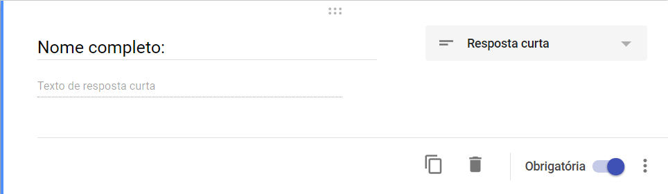
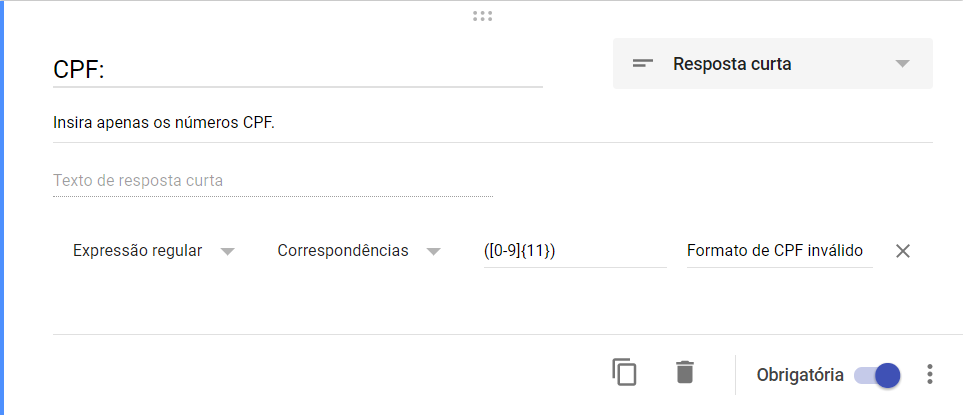
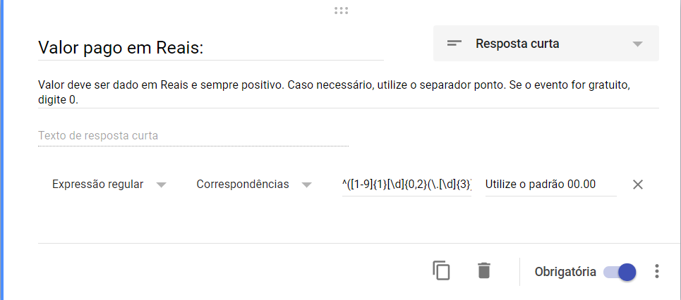

## O formulário

Devido a necessidade de modificações constantes (adicionar ou retirar itens) deste formulário optou-se pela utilização de um "Formulário Google", pois com ele é fácil modificar o conteúdo dos seus campos.
Todos os campos do formulário são de preenchimento obrigatório.

### Senha de acesso:
Este campo é um campo de validação necessário para garantir que apenas membros do IEEE possam utilizar o formulário:

!!! note  ""
    Titulo do campo: Senha de acesso.

    Tipo de campo: Resposta curta

    Validada por uma expressão regular* do tipo: 

    ​``` 
    ^suasenha$
    ​```
    
    Mensagem de aviso em caso de erro: Senha inválida!

Para modificar a senha você deve modificar a parte textual do validador. Os símbolos `^` e `$` são comandos da expressão regular. No exemplo da figura a o usuário deve escrever "suasenha" para conseguir validar a resposta.

[](imagens/Recibos/cr_senha.png)


### Referente à:
Neste Campo selecionarei o motivo gerador do recibo, ou seja o que o destinatário do recibo está adquirindo. 

!!! note  ""
    Titulo do campo: Referente à (ao):

    Tipo de campo: Lista suspensa


Para adicionar um campo basta digitar o produto na linha "Adicionar opção". É importante que o texto escrito neste campo faça sentido quando se ler a seguinte frase ".... referente a(o) **OPÇÃO**". Para remover um campo basta clicar no "X" que está à direita. Na figura abaixo é possível visualizar estas ações.

[](imagens/Recibos/cr_refetentea.png)

### Unidade Responsável:
Campo em que é será selecionada a unidade que está recebendo do dinheiro referente ao recibo.

!!! note  ""
    Titulo do campo: Unidade Responsável:

    Tipo de campo: Lista suspensa


Para adicionar um campo basta digitar o produto na linha "Adicionar opção". É de extrema importância que utilizem apenas as siglas da unidade para referenciar ela. Para remover um campo basta clicar no "X" que está à direita. 

### Nome Completo

Local onde deverá ser preenchido o nome completo da pessoa que receberá o recibo.

!!! note  ""
    Titulo do campo: Come completo.

    Tipo de campo: Resposta curta

[](imagens/Recibos/cr_nome.png)

### CPF

Campo para registro dos números do CPF da pessoa que adquiriu que receberá o recibo.

!!! note  ""
    Titulo do campo: CPF.

    Tipo de campo: Resposta curta

    Descrição: Insira apenas os números CPF.

    Validada por uma expressão regular do tipo: correspondente à:

    ​``` 
    ([0-9]{11})
    ​``` 
    
    Mensagem de aviso em caso de erro: Formato de CPF inválido!

[](imagens/Recibos/cr_CPF.png)

A expressão regular me diz para escrever 11 dígitos numéricos qualquer coisa diferente disso ela me retornará a mensagem de erro.

### Valor

Este campo é onde devemos digitar o valor do recibo.

!!! note  ""
    Titulo do campo: Valor pago em Reais.

    Tipo de campo: Resposta curta

    Descrição: Valor deve ser dado em Reais e sempre positivo. Caso necessário, utilize o separador ponto. Se o evento for gratuito, digite 0.

    Validada por uma expressão regular* do tipo: correspondente à:

    ​``` 
    ^([1-9]{1}[\d]{0,2}(\.[\d]{2})*(\.[\d]{0,2})?|[1-9]{1}[\d]{0,}(\.[\d]{0,2})?|0(\.[\d]{0,2})?|(\.[\d]{1,2})?)$
    ​```
    
    Mensagem de aviso em caso de erro: Utilize o padrão 00.00

[](imagens/Recibos/cr_valor.png)

A expressão regular deste campo me permite digitar números de até duas casas decimais separados por ponto.

### E-mail
Campo para o e-mail da pessoa que receberá o recibo.

!!! note  ""
    Titulo do campo: E-mail.

    Tipo de campo: Resposta curta

    Descrição: Insira o e-mail para o qual o recibo será enviado.

    Validada por uma expressão regular* do tipo: correspondente à:

    ​``` 
    [a-zA-Z0-9_\.\+-]+@[a-zA-Z0-9-]+\.[a-zA-Z0-9-\.]+
    ​```
    
    Mensagem de aviso em caso de erro: Digite um e-mail válido.

[](imagens/Recibos/cr_email.png)