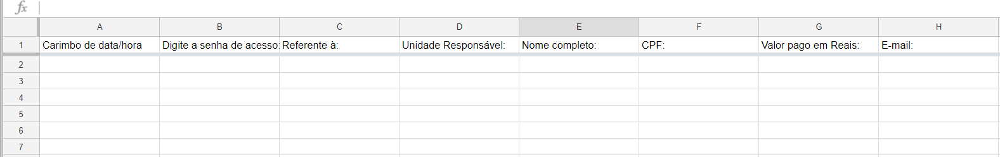
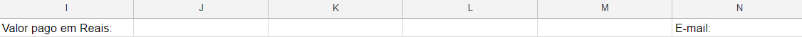

## A Planilha Google

A planilha de respostas deve ser vinculada ao formulário! Para fazer isso vá na aba respostas do seu formulário e clique nos três pontinhos mostrado na figura abaixo.

[](imagens/Recibos/cr_planilhaform.png)

Um menu irá aparecer, selecione a opção "Selecionar destino da resposta". Uma janela semelhante amostrada a baixo apareceu em sua tela crie uma nova planilha ou selecione uma já existente (aconselho criar uma nova planilha).

[](imagens/Recibos/cr_planilhamenu.png)

A planilha criada (ou a aba da nova planilha) deve ser assim:

[](imagens/Recibos/cr_planilhacriada.png)

### Renomeie a pasta de trabalho!
Troque o nome da sua pasta de trabalho para "Recibos", para fazer isso clique com botão direito sobre o nome da pasta de trabalho e vá em renomear.

[](imagens/Recibos/cr_renomearplanilha.png)

### Campo 
Vá insira uma nova coluna a esquerda da coluna "A" (clique na célula "A" com botão direito e vá em inserir coluna à esquerda)

[](imagens/Recibos/cr_campo.png)


Na nova A1 agora vazia escreva a palavra "". Sua nova planilha deve ficar assim:

[](imagens/Recibos/resultadocampo.png)

### Data e Hora
Crie uma nova coluna C de forma que a coluna B seja o "Carimbo de data/hora" e a coluna "D" seja a "Digite a senha de acesso:" na célula B1 digite a seguinte formula:

[](imagens/Recibos/cr_novacolunac.png)

``` 
=arrayFormula(SE(LIN(INDIRETO("B1:B" & TEXTO(CONT.VALORES(B:B);"#")))=1;"Data e Hora";TEXTO(DIA(B1:B);"##")&" de "& TEXTO(B1:B;"MMMM")&" de " & ANO(B1:B)&" às "&  TEXTO(HORA(B1:B);"00")&"h"&TEXTO(MINUTO(B1:B);"00")))
```

Essa formula é responsável por retirar pegar da Data da coluna B e transformar ela num texto com o seguinte formato: "1 de janeiro de 1900 às 00h00."

### E-Mail
O campo e-mail deve estar agora na coluna J. Você vai inserir 4 novas colunas a esquerda deste campo fazendo assim que seu campo e-mail vá para coluna "N".

[](imagens/Recibos/cr_novocampoemail.png)

### Tipo de Transação
Na Coluna "J" (que deveria estar vazia) vá até a célula K1 e digite: 

``` 
=arrayFormula(IF(ROW(INDIRECT("A1:A" & TEXT(COUNTA(A:A);"#")))=1;"Tipo de transação";"Entrada"))
```

Assim para cada valor linha que for preenchida na planilha você irá dizer que é uma "Entrada de Caixa"

### Valor pago em Reais

Na celula K1 digete a seguinte formula, (a coluna L deve estar vazia)

``` 
=query(A:K; "select I where I is not null format I 'R$#####0.00' ";1)
```

Ela formata os valores de I (Como "Valor pago em Reais:" do formulário) para formato monetário.

### Ano
Na Celula L1 digite a formula abaixo para extrair o ANO em que foi emitido o recibo.

``` 
=arrayFormula(IF(ROW(INDIRECT("B1:B" & TEXT(COUNTA(B:B);"#")))=1;"Ano";YEAR(B1:B)))
```

### Mes
Na Celula M1 digite a formula abaixo para extrair o MES em que foi emitido o recibo.

``` 
=arrayFormula(SE(LIN(INDIRETO("B1:B" & TEXTO(CONT.VALORES(B:B);"#")))=1;"Mês";TEXTO(B1:B;"MM")))
```

### Pasta Administrativa
Crie uma nova Pasta de trabalho e troque seu nome para "Pasta adm". Nesta pasta vá ate A1 e digite Unidade, de A2 até A9 o nome das unidades (Ramo, AESS, CS, CPMT, EMBS, PES, RAS ,TEMS) na célula C1 digite: "Nº de Recibos +1" em C2 copie a seguinte formula:

``` 
=CONT.SES(Recibos!F:F;A2;Recibos!L:L;"=2017")+1
```

O valor retornado será o número de recibos já emitidos somado a 1. Veja o Exemplo abaixo: Atente-se ao detalhe que que a coluna B está oculta!

[](imagens/Recibos/cr_pastaAdm.png)